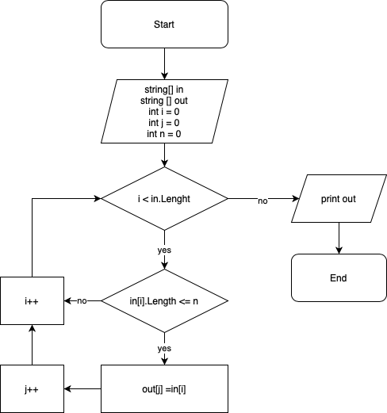

**Задача:**  Написать программу, которая из имеющегося массива строк формирует массив из строк, длина которых меньше либо равна 3 символа. Первоначальный массив можно ввести с клавиатуры, либо задять на старте выполнения алгоритма. При решении не рекомендуется пользоваться коллекциями, лучше обойтись исключительно массивами.

## Описание решения:
 + Объявляем два массива: входной (In) и выходной (Out), оба со счётчиками;
 + С помощью цикла for перебираем значения иходного массива;
 + Внутри цикла проверяем условие: длина элемента <=3;
 + Если условие проверки выполняется, элемент массива In заносится в элемент массива Out, увеличиваем счётчики: массива In при переходе на каждый следующий элемент, массива Out - при добавлении нового элемента;
 + Повторяем проверку элементов до тех пор, пока не достигнем конца входного массива In;
 + Возвращаем массив Out как результат решения задачи.  
 
 ## Блок-схема решения:
 
 

